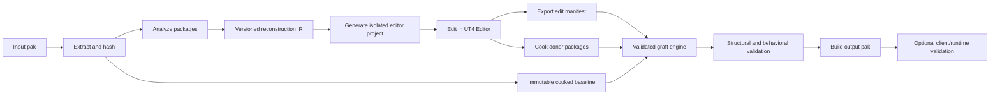

# UT4 cooked-map recovery and patching tool: implementation plan

Status: Milestones 0 through 6 are implemented for their initial support profiles. Milestone 7 has proved runtime loading, distinct package/URL renaming, AssetRegistry synchronization, compiled-behavior preservation, and a real collision-repair workflow on CTF-Switchback-PRO2. The repaired map loads and the collision changes take effect, although physical testing found an edge approach that the current approximate editor representation did not make obvious. This result locks the product direction on a cooked-baseline patch workspace with explicit fidelity labels, followed by independent asset extraction and injection interfaces. Based on the Glass, Example_Map, SM_Chair, Blueprint_CeilingLight, and CTF-Switchback-PRO2 experiments performed with UT4 Editor 4.15.0-3525360+++UT+Release-Next.

## 1. Product objective

Build a Windows tool that accepts a UT4 custom-map pak and produces:

1. an isolated project containing an editable representation of the map;
2. an inventory of preserved, reconstructed, substituted, and unsupported content;
3. an edit manifest describing the user's intentional changes;
4. a rebuilt pak that preserves original cooked data except where an approved edit requires replacement;
5. a validation report describing structural, geometric, collision, behavioral, and runtime evidence.

The primary use case is repairing geometry and collision defects. Recovering original authoring history, comments, graph layout, import paths, and equivalent editor organization is outside the core objective. The generated editor map is an authoring surface for patch operations, not recovered original source.

The cooked baseline is always authoritative. Untouched cooked data is copied or hash-verified, and the editor workspace may change runtime output only through an explicit, validated patch operation or a compatible cooked-donor graft.

The tool must never silently treat a proxy as runtime-equivalent. Every object receives a support classification, and packaging stops when an edited object exceeds the implemented support level.

## 2. Architectural decision

Use a hybrid architecture:

- A standalone .NET application owns extraction, package analysis, reconstruction state, semantic diffs, cooked-package grafting, validation, and pak creation.
- A donor-cooker interface owns operations that require Unreal's native editor/runtime code: creating source meshes, rebuilding BSP, cooking PhysX collision, saving editor packages, and cooking donors. The current binary-only installation uses generated interchange workspaces and interactive import; a compiled helper is optional when matching UT4 source and headers are available.
- The user's original cooked packages remain immutable baselines.
- The editable project is a proxy workspace and donor generator. It is not automatically treated as the final runtime package.
- The final packager starts from copies of the original cooked packages and applies a narrowly scoped edit manifest.



This avoids reimplementing all of UE4.15's mesh builders, BSP builder, cooker, and PhysX integration. It also avoids replacing working compiled behavior merely because the editor cannot display its original graph. Recovered OBJ/mesh IR is the canonical editable interchange representation for a mesh; an editor-created `.uasset` is a temporary donor and does not need to reproduce lost import metadata.

## 3. Technology and repository structure

Use C#/.NET for the standalone application. The existing PackageAudit tool, UAssetAPI, and CUE4Parse probes already establish that this environment can parse the relevant packages. Keep Python research scripts as fixtures and reference implementations until their logic is ported and covered by tests.

The editor bridge should be a C++ editor-only plugin or project module compiled for the exact UT4 editor build. It must not be included in the published runtime pak.

Proposed repository layout:

```text
src/
  Ut4Recon.Cli/                 command-line entry point
  Ut4Recon.Core/                project state, IR, diagnostics, policies
  Ut4Recon.Pak/                 UnrealPak orchestration and mount inventory
  Ut4Recon.Package/             UE4.15/UT4 package reader and writer
  Ut4Recon.Geometry/            mesh, BSP, UV, tangent, bounds operations
  Ut4Recon.Grafting/            cooked object-graph graft engine
  Ut4Recon.Validation/          semantic and binary validation
  Ut4Recon.EditorProtocol/      request/result schema shared with the plugin
editor/
  UT4Reconstruction/            editor-only C++ helper module
tests/
  Unit/
  Golden/
  EditorIntegration/
  RuntimeIntegration/
fixtures/
  Glass/
  ExampleMap/
  Chair/
  BlueprintCeilingLight/
schemas/
  reconstruction-ir.schema.json
  edit-manifest.schema.json
  validation-report.schema.json
research/                       retained experiments and evidence
```

Do not vendor generated editor caches, stock UT4 content, extracted user packages, or built paks into source control.

## 4. User-facing workflow

The first release should be CLI-led, with a small editor panel. A desktop GUI can wrap the same commands after the pipeline stabilizes.

Proposed commands:

```text
ut4recon inspect Map.pak --editor E:\path\to\UnrealTournamentEditor
ut4recon create-project Map.pak --output RecoveredMap
ut4recon validate-project RecoveredMap
ut4recon build RecoveredMap --output Map-Repaired.pak
ut4recon diff RecoveredMap
ut4recon verify-pak Map-Repaired.pak
```

`inspect` produces an inventory without modifying anything. `create-project` extracts immutable baselines and creates an isolated project. The editor panel exposes `Validate proxies`, `Export edit manifest`, and `Cook modified donors`. `build` refuses stale manifests, unexpected package changes, unresolved dependencies, and unsupported edits.

The project stores its private state under:

```text
RecoveredMap/.ut4recon/
  project.json
  input-manifest.json
  reconstruction-ir.json
  support-report.json
  edit-manifest.json
  baseline/                     extracted cooked packages, read-only
  donors/                       cooked results from edited proxies
  reports/
```

The generated Unreal project contains only proxies, reconstructed assets, the editor bridge, and links or references to matching installed stock content. It must not require the original uncooked custom assets.

## 5. Version and input gate

Support exactly one initial profile:

```text
Engine: UE4/UT4 4.15
Known editor: 4.15.0-3525360+++UT+Release-Next
Platform: WindowsNoEditor
Pak encryption: unsupported initially
Pak signing: inspect and report; output signing unsupported initially
```

Before parsing, record:

- SHA-256 and size of every input pak and extracted package;
- pak mount paths, compression method, order, and duplicate paths;
- package summary versions, flags, custom versions, and engine version;
- whether `.uexp`, `.ubulk`, or sidecar files exist;
- unresolved imports and expected stock dependencies;
- exact editor and UnrealPak binaries selected by the user.

Unknown versions are inspection-only until a profile explicitly supports them. Parsers must use bounded reads and reject inconsistent counts, offsets, element sizes, and package indices.

## 6. Reconstruction intermediate representation

Create a versioned, loss-aware IR. It is an internal model and audit record, not a claim that every native structure is understood.

Every object needs a stable identity:

```json
{
  "id": "sha256(input-package-path + original-full-object-path + class-path)",
  "package": "/Game/Maps/Example",
  "objectPath": "Example.PersistentLevel.Actor.Component",
  "classPath": "/Script/Engine.StaticMeshComponent",
  "originalExportIndex": 42,
  "originalPayloadHash": "...",
  "support": "preserve|property-editable|reconstructable|proxy-only|unsupported"
}
```

IR records must distinguish:

- interpreted tagged properties;
- decoded native fields;
- opaque native spans and bulk payloads;
- object/import references;
- generated/editor-only data known to be absent;
- reconstruction defaults that the tool must invent;
- evidence tying a reconstructed value to the cooked input.

Actor labels and export indices are not stable identities. The editor bridge assigns a persistent reconstruction ID to every proxy and exports the ID-to-object mapping before cooking. Object renames, duplicates, additions, and deletions become explicit manifest operations.

## 7. Package codec strategy

During early implementation, use:

- UAssetAPI for UE4 package summaries, name/import/export tables, tagged properties, Kismet bytecode, and writes already verified for the fixtures;
- CUE4Parse for read-only native mesh and BodySetup decoding;
- dedicated UT4 serializers for native structures required by grafting.

Long term, isolate third-party differences behind `Ut4Recon.Package`. Never allow two libraries' raw package indices or inferred engine profiles to leak into the IR.

Required native codecs, in implementation order:

1. `UModel`, `FBspNode`, `FBspSurf`, `FVert`, model vertex buffers;
2. `UStaticMesh` render-data summary and LOD resources;
3. `UBodySetup`, aggregate geometry, and cooked-format bulk data;
4. `UNavCollision` preservation/grafting;
5. atmospheric-fog bulk-data headers already handled by the prototype;
6. material compiled resources for preservation only;
7. additional types only when a fixture and validation method exist.

Every writer must support object-reference and FName remapping. Copying native bytes between packages without remapping embedded references is prohibited unless the codec proves that the span contains no package-relative values.

## 8. Support policy by object type

The editor presents four user-facing fidelity categories. These describe what the workspace means; they are not merely internal parser states.

| Fidelity category | Editor representation | Permitted output behavior |
|---|---|---|
| Exact editable | Surviving cooked values and geometry represented without semantic substitution | Export only implemented serialized-property or graph operations |
| Reconstructed | Runtime geometry decoded into an editable interchange representation | Accept only through a declared reconstruction/donor profile and comparison gate |
| Behavioral proxy | Visible placement/components for an actor whose cooked behavior remains authoritative | Edit allowlisted instance state; preserve compiled class, bytecode, defaults, and delegates |
| Context only | Approximate geometry, bounds, marker, or other non-authoritative representation used to understand the map | Do not export workspace edits; copy its cooked payload unchanged |

Every editor object must show its fidelity category, recovered evidence, invented workspace metadata, available operations, and packaging consequence. An approximation must never use the same visual status as exact cooked geometry. Actual cooked collision is displayed independently from render geometry wherever collision editing is offered.

`Context only` is the panel's user-facing name for the preservation state called
`Preserve only` by the current external workspace reports. The protocol will retain
a stable machine value during migration; changing the display label must not alter
the preservation policy.

Each object is classified independently:

| Support level | Editor representation | Output policy |
| --- | --- | --- |
| Preserve | Optional read-only proxy | Original cooked payload copied unchanged |
| Property-editable | Editable proxy with allowlisted fields | Patch tagged properties into original export |
| Reconstructable | Native editable asset/actor | Cook donor and graft validated object closure |
| Proxy-only | Visible placeholder | Preserve original; block unsupported proxy edits |
| Unsupported | Inventory entry only | Preserve if unreachable/unchanged; otherwise stop |

Initial class policy:

- Native actors/components with tagged transforms and collision responses: property-editable.
- Stock asset references available in the matching editor: property-editable or reconstructable.
- Static meshes: reconstructable after the mesh milestone passes.
- BSP models: reconstructable after the BSP graft milestone passes.
- Blueprint-generated classes: preserve; selected instance properties may be property-editable.
- Empty construction-script Blueprints: optionally flattenable after bytecode proof.
- Behavior-bearing Blueprints: proxy-only until explicit behavior support exists.
- Materials: preserve compiled package; use an editor preview proxy where necessary.
- Landscapes, foliage, streaming levels, navmesh, skeletal assets, audio, particles, and sequences: unsupported until separately implemented and tested.

## 9. Editor bridge

The editor module communicates through versioned JSON request/result files so the standalone process never depends on UI automation.

Native build status: a minimal editor-only module now compiles with Visual Studio
2022 against the recovered UE4.15/UT Main CL 3228288 headers and loads in the
installed `4.15.0-3525360+++UT+Release-Next` editor. The binary bootstrap derives
an import library from the exact installed `UE4Editor-Core.dll` exports and embeds
the editor's compatible module API CL 3525109. This avoids the unavailable UT
dependency archives and the missing VS2015 toolchain. The proof module uses no
reflected types; Slate/editor module compatibility must be certified interface by
interface, and `UCLASS`/`USTRUCT` additions remain gated on recovering or building
the matching UnrealHeaderTool.

Required operations:

```text
CreateMapFromActorIR
CreateStaticMeshFromRecoveredData
SetStaticMeshCollision
CreateBrushFromRecoveredPolygons
CreateProxyActor
ExportEditManifest
ValidateReconstructionProject
CookDonorPackages
```

### Static mesh creation

The bridge creates `UStaticMesh` directly instead of routing through the generic FBX commandlet:

1. construct an `FRawMesh` per recovered LOD;
2. restore wedge indices, positions, tangents, UV channels, vertex colors, face material indices, and smoothing masks when recoverable;
3. create `FStaticMeshSourceModel` records with reduction disabled by default;
4. restore material-slot order, section collision, sockets, bounds-related settings, lightmap index/resolution, and collision LOD;
5. populate `UBodySetup::AggGeom` from recovered simple collision;
6. set collision flags and physical-material references;
7. build render and physics data;
8. save the package and return hashes and diagnostics.

Defaults such as import filename, source timestamp, graph organization, reduction intent, and unavailable build settings must be marked `invented-editor-metadata`. Runtime-affecting defaults require a comparison gate before the asset is eligible for packaging.

### BSP creation

The bridge imports decoded polygons, surface materials, texture bases, flags, and lightmap scale. The first version may expose the finished surface set as one recovered brush. It must label the lost additive/subtractive history and prevent the UI from suggesting that the original brush stack was recovered.

After rebuild, export the new `UModel`, model components, BodySetups, and surface diagnostics as a donor closure. Measure surface coverage, plane displacement, bounds, topology, and collision separately.

### Proxy actors

Complex Blueprint actors use proxy classes/components that preserve:

- original reconstruction ID and class path;
- transform and attachment hierarchy;
- component bounds and visible meshes where possible;
- allowlisted editable instance properties;
- a clear editor warning that the proxy is not the runtime class.

The bridge does not emit proxy classes into the final pak.

### Locked panel and workspace contract

The native panel is a thin client over the existing backend and JSON protocol. It
does not implement a second package writer or a separate support policy. The
initial panel has three views:

1. **Map view** reports representation coverage and controls viewport filters.
2. **Selected object** reports editor representation, runtime target, fidelity,
   collision source, evidence, limitations, supported operations, detected
   changes, and the exact packaging consequence.
3. **Build** lists pending operations, unsupported changes, preservation checks,
   output identity, validation results, and the final pak location.

Visibility, editability, and exportability are independent states. The workspace
shows useful non-editable context rather than limiting the viewport to objects
that can be exported. Its default geometry-repair view includes editable objects,
exact collision overlays, context geometry, and gameplay markers. Optional
filters expose behavioral proxies, unsupported markers, and the complete
inventory. Decorative or high-volume context may start hidden when it harms
editor usability.

The presentation contract is:

- Exact editable objects use their normal appearance with an optional blue/cyan
  status outline.
- Reconstructed objects use a distinct blue/cyan wire or status treatment and
  disclose the reconstruction and donor gate.
- Behavioral proxies use amber status and disclose that compiled cooked behavior
  remains authoritative.
- Context-only objects use gray/translucent status and disclose that workspace
  edits cannot be packaged.
- Missing or unsupported representations use magenta/red markers.
- Supported collision overlays use green; an invalid or non-exportable collision
  edit uses red.

Colors are optional overlays, not replacements for a readable map view. The World
Outliner also groups generated actors under `UT4 Recon/Editable`,
`Reconstructed`, `Behavioral Proxies`, `Context Only`, `Collision`, and
`Unsupported Markers`. Short actor-label suffixes reinforce the category; the
panel contains the complete explanation.

For every selection, the panel separately identifies the workspace actor and its
runtime target. It explicitly states whether the visible actor is an exact object,
a reconstructed donor, a behavior-preserving proxy, a context approximation, or
a non-colliding visualization overlay. It also states whether that workspace
actor itself is excluded from the final pak.

Unsupported changes have three defenses: visible status before editing,
immediate feedback when a workspace change is detected, and mandatory export
validation. The export step is authoritative. It must block and list unsupported
changes rather than silently ignore them. A successful export contains only
operations recognized by the shared capability policy.

The initial native module uses Slate, editor selection/delegate APIs, JSON files,
and asynchronous child-process execution. Long backend operations never run on
the editor UI thread. The first release introduces no reflected Unreal types and
therefore does not require UnrealHeaderTool.

### Locked collision-creation contract

The panel exposes two concepts:

1. **Add Collision Box** creates a new runtime `BlockingVolume` from a bundled,
   version-certified box closure. The user places, rotates, and applies supported
   scaling/dimensions in the workspace. Export records a complete actor-closure
   clone with a new identity and level reference. It does not depend on finding a
   nearby source volume in the current map.
2. **Add Custom Collision** authors geometry in an isolated donor, asks the exact
   UT4 editor to build/cook its `UModel` and PhysX `BodySetup`, and grafts the
   validated cooked closure into the baseline. This is a later capability than
   the initial box workflow.

Both operations create genuinely new runtime actors. Internally they use a known
closure because a blocking volume consists of an actor, BrushComponent, UModel,
BodySetup/cooked collision, package-table entries, and a persistent-level
reference. Template or donor provenance is an implementation safety boundary,
not a requirement that the new blocker retain the source object's placement.

The version-certified box template is produced once with the supported UT4
editor and distributed with the tool. Its package version, class/import paths,
closure shape, native-layout fingerprints, collision behavior, and editor/runtime
versions are pinned. Installation or project creation rejects a template that
does not match the active support profile.

The initial box operation supports translation, rotation, and only the scaling or
dimension changes certified by the template fixture. Arbitrary brush-vertex edits
are rejected and directed to the custom-donor workflow. Entirely synthetic
serialization without a template or cooked donor is outside version 0.1.

## 10. Edit manifest

The edit manifest is the security and correctness boundary between editor work and package surgery.

Each operation contains:

```json
{
  "operation": "set-property",
  "objectId": "...",
  "originalPayloadHash": "...",
  "propertyPath": "RelativeLocation",
  "before": {"x": 0, "y": 0, "z": 0},
  "after": {"x": 20, "y": 0, "z": 0},
  "source": "editor-proxy",
  "supportRule": "native-component-transform-v1"
}
```

Initial operations:

- set an allowlisted tagged property;
- move/rotate/scale an existing actor or component;
- change collision profile/response/trace flags;
- delete an existing actor;
- add a supported native/stock actor;
- replace BodySetup closure;
- replace static-mesh closure;
- replace BSP model closure.

The manifest includes hashes of the baseline, editor map, donor cook, tool version, editor version, and support policy. Any baseline mismatch or unclassified editor change invalidates it.

## 11. Cooked-package graft engine

The graft engine always writes to a new output tree.

### Property graft

For transforms, collision responses, material overrides, and other allowlisted tagged fields:

1. locate the original object by stable identity and verified object path;
2. verify the expected original value and payload hash;
3. encode the new property using the original class/property type;
4. rebuild package tables and offsets;
5. prove that nonallowlisted properties and exports are semantically unchanged.

### Object-graph graft

Native donor content is copied as a closure, not as a single arbitrary export. A closure may include:

- static mesh, BodySetup, NavCollision, sockets, and related bulk data;
- UModel, UModelComponents, BodySetups, and level references;
- new actor, its components, templates, and required imports.

The engine constructs a canonical graph, allocates destination imports/exports/names, remaps all known references, serializes native structures, and rejects opaque spans that may contain unremapped indices.

### Collision-only mesh graft

This is the preferred first mesh mutation:

1. preserve the original cooked static-mesh render export and material data byte-for-byte;
2. take BodySetup and necessary collision/native bulk data from the cooked donor;
3. remap and graft the BodySetup closure into the original mesh package;
4. update only required GUIDs/references;
5. verify the original render-data hash is unchanged.

### BSP graft

Start with the original cooked map so level script and unrelated actor payloads survive. Replace only the model closure and the corresponding level/model-component references. Regenerated navigation or lighting is included only if the user explicitly requests and the support profile validates it.

## 12. Compiled behavior policy

Compiled behavior is preserved by default, not decompiled and regenerated.

For every Blueprint package reachable from the map:

- retain the original cooked package and bytecode unchanged;
- preserve generated-class paths, inheritance, defaults, component templates, delegates, and function exports;
- expose only allowlisted instance properties through editor proxies;
- patch transforms or properties into original cooked actor/component exports;
- block edits that require changing bytecode or construction behavior.

Verification requires byte-identical bytecode for all preserved functions and canonical equality for generated-class metadata and dependencies.

Optional future Blueprint decompilation uses a separate support table by opcode/pattern. It must generate an explicit behavioral proxy and pass functional tests. It is not part of the initial geometry-repair release.

## 13. Validation system

Validation produces machine-readable JSON and a human report. Passing pak integrity alone is never described as player equivalence.

### Package invariants

- all package indices, offsets, sizes, names, and dependencies resolve;
- every untouched export retains its original raw hash where layout permits, otherwise canonical native/property equality;
- preserved Blueprint bytecode hashes are identical;
- every changed export is explained by one manifest operation;
- no proxy/editor helper class is referenced by the output;
- no source or cooked asset from the user's editor installation is accidentally bundled unless required as an allowed dependency;
- UnrealPak list and integrity test pass.

### Mesh invariants

- LOD count and screen-size policy;
- positions and triangle topology, including winding;
- normals, tangents, UV channels, colors, material slots, and section flags;
- bounds and sockets;
- simple collision primitive types, transforms, hull planes, and vertices;
- complex collision triangles and collision LOD;
- collision trace flag and physical-material references;
- unchanged render hash for collision-only grafts.

### BSP invariants

- surface material and flags;
- projected surface coverage and plane displacement;
- bounds, connected components, and open/nonmanifold edges;
- model/component reference consistency;
- collision query results;
- separately reported changes in node/surface partitioning.

### Collision functional tests

Create deterministic Unreal automation fixtures that compare original and reconstructed collision using:

- line traces on relevant collision channels;
- sphere and capsule sweeps;
- overlaps;
- traces near edges, thin surfaces, and both face directions;
- player-sized movement sweeps;
- weapon-channel traces.

Record hit/miss, distance, location, normal, physical material, object, and component. Tolerances are versioned per test and visible in the report. A structural match cannot substitute for these tests.

### Behavior functional tests

Fixtures observe construction and event results rather than graph appearance. Examples:

- CeilingLight variables must produce the expected point-light intensity, color, and radius;
- delegates must bind the same functions;
- event entry points must mutate the same observed state;
- component creation/attachment order and replicated defaults must match;
- preserved functions must retain identical bytecode.

### Runtime validation

Run the original and rebuilt pak in the same standalone UT4 client and environment. Collect map load, dependency, actor, collision, and scripted-test results. Runtime certification remains `unavailable` on machines without a matching client; it must never be inferred from editor Map Check.

## 14. Test fixture matrix

| Fixture | Purpose | Required oracle |
| --- | --- | --- |
| Glass | map/property/proxy/material-preservation baseline | existing source/cooked pair |
| SM_Chair | render buffers and one convex hull | source/cooked pair created locally |
| Example_Map BSP subset | substantial compiled BSP | existing source/cooked pair |
| Blueprint_CeilingLight | nonempty construction script | source/cooked pair created locally |
| CollisionPrimitives | box, sphere, capsule, multiple convex hulls | new authored fixture |
| ComplexCollision | complex-as-simple and section collision | new authored fixture |
| MeshLODs | multiple LODs, UV channels, sockets, vertex colors | new authored fixture |
| BlueprintBehavior | branches, timeline, delegates, spawn, replication defaults | new authored fixture |
| MapIntegration | mixed supported and unsupported assets | new authored fixture |

For every fixture:

1. retain source only as the oracle;
2. cook a pinned input;
3. reconstruct using only cooked input and allowed stock dependencies;
4. perform an unchanged round trip;
5. perform one intentional edit;
6. cook/graft/package;
7. run structural and functional comparisons;
8. record tool/editor hashes and logs.

## 15. Milestones and exit gates

### Milestone 0: freeze the research baseline

Deliverables:

- pin tool/library/editor versions and fixture hashes;
- move reusable research logic behind repeatable commands;
- preserve current Glass/BSP/mesh/Blueprint reports as golden evidence;
- establish CI-safe tests that do not require the editor.

Exit gate: all retained fixtures reproduce their current decoded counts and hashes from a clean workspace.

### Milestone 1: input inventory and IR

Deliverables:

- `inspect` and `create-project` shells;
- pak extraction through pinned UnrealPak;
- package/dependency graph;
- stable object identities;
- versioned IR and support report;
- bounded parser diagnostics.

Exit gate: Glass and Example_Map inventories are deterministic and every export is classified without modification.

### Milestone 2: direct property patcher

Status: complete. The Glass exit fixture changes one component transform and one existing material reference while changing exactly two approved map exports. The other 61 exports retain their raw payload hashes; the Blueprint and material packages are byte-identical; and UnrealPak integrity testing passes. Example_Map tests cover collision shape, scalar radius, and a named collision-response channel. A generated split Glass package proves `.uexp` read/write and export-hash isolation.

Deliverables:

- manifest schema;
- transform, collision-response, material-override, and supported scalar property edits;
- original-baseline package writer;
- semantic diff and untouched-export proof;
- output pak build.

Exit gate: scripted Glass edits change only the approved fields and preserve Blueprint/material packages and all unrelated exports.

### Milestone 3: editor proxy project

Status: complete for the initial profile. The Glass proxy generator emits 18 actors, 25 components, and one nested subobject; 39 non-system actor/component reconstruction IDs survive a clean editor save/export. An unchanged round trip emits zero operations. Moving the Floor from Z=20 to Z=40 emits one stable-ID operation. Deleting Cube2 changes only the persistent-level export and preserves its now-unreachable actor closure. Adding a compatible cube clones and remaps one actor plus one component export while reusing verified imports. A combined move/delete/add build changes four explained exports, verifies 61 untouched exports, passes UnrealPak testing, and produces byte-identical paks on repeated builds. Duplicate IDs caused by reimporting into a used proxy map are rejected, so reconstruction import requires a fresh workspace. Additions outside the simple existing-mesh/material `StaticMeshActor` profile remain unsupported.

Deliverables:

- isolated project generator;
- actor/component T3D or native creation;
- persistent reconstruction IDs;
- editor panel and JSON protocol;
- edit-manifest export;
- Glass unchanged round trip through the new architecture.

Exit gate: moving, deleting, and adding supported actors produces deterministic manifests and valid output paks without fixture-specific scripts.

### Milestone 4: static mesh and collision

Status: complete for the initial one-convex-hull profile. `Ut4Recon.Geometry` decodes the retained SM_Chair into a versioned IR with exact hashes for position, index, tangent/UV, section, convex-hull, and cooked PhysX streams. It emits render-only, collision-only, and combined Unreal `UCX_` OBJ files. `create-project` generates these workspaces automatically. A changed source fixture moves four hull vertices from X=40.2119 to X=35; UT4 Editor recooked it into a donor with unchanged render streams and changed collision. The manifest-driven graft changes only the BodySetup export, verifies two untouched exports, matches the donor collision semantically, and produces repeat paks with SHA-256 `006a04e60b8985c4d1fdebf57aa675201e392cdeab60186369b1b060f42a3f2c`. The matching binary editor still asserts in `ImportAssetsCommandlet` before saving generated OBJ imports, so interactive import or an existing compatible source asset is the current donor-cooker path.

Deliverables:

- native mesh/BodySetup decoder;
- generated editor mesh workspace and donor-cooker interface;
- collision editor support;
- collision-only graft;
- render and collision validators;
- retained original/changed source-and-cooked SM_Chair fixture pair for the initial one-convex-hull profile;
- primitive, multiple-convex, and complex/per-poly collision as separately gated profile extensions.

Exit gate for the initial simple-convex profile: SM_Chair has a complete editable interchange workspace; unchanged geometry meets all mesh comparisons; collision-only output preserves original render bytes; a verified cooked donor can be selected through the edit manifest and packaged; deterministic offline collision queries pass. Saving/cooking a changed donor is certified per donor-cooker environment. Runtime PhysX A-B queries remain the Milestone 7 gate.

### Milestone 5: BSP grafting

Do not begin BSP graft implementation until the Milestone 4 donor operation is integrated into the normal recovery-project build and a changed cooked donor can be produced through at least one supported donor-cooker environment.

Status: complete for the initial Example_Map profile. The production decoder reads all geometry arrays required by the retained profile and preserves hashes for uninterpreted native header/tail bytes. `create-project` emits a T3D/OBJ recovered-brush workspace automatically. The editor-rebuilt recovered brush has identical bounds and offline ray results, with a `7.9e-9` surface-area difference ratio despite BSP repartitioning from 987 to 1,005 polygons. `replace-bsp` and `build` accept both a hash-pinned compatible-shell donor and a fresh recovered-brush donor. The fresh-shell graft remaps external and native references, maps 67 rebuilt ModelComponent/BodySetup pairs into the 66-pair original closure, appends the additional pair, preserves opaque Level data, verifies 2,134 unrelated exports, and exactly matches donor geometry and normalized collision payloads. Its repeated pak builds have SHA-256 `cfe5dbae47dfa2ca43c6171a1a0472b90422fdb1fd6a935c8466e16841d14cd3`. Runtime collision queries remain gated on a standalone client in Milestone 7.

Deliverables:

- complete required UModel codec;
- recovered-brush creation;
- donor model closure export;
- BSP graft into original cooked map;
- geometric and collision validation.

Exit gate: Example_Map BSP donor replaces only the intended model closure, preserves level bytecode and unrelated actors, and passes declared surface/collision tolerances.

### Milestone 6: compiled behavior preservation

Status: in progress. `inspect` and `create-project` emit a compiled-behavior baseline for every package-local Blueprint-generated class and function. The snapshot records semantic bytecode and serialized function hashes, opcodes and call targets, generated-class metadata and inheritance, class defaults, owned component/SCS templates, delegate data, and a fingerprint of the complete import table. Every normal `build` recomputes the immutable baseline and rejects any staged behavior difference before packaging. Editor actors backed by an inventoried cooked Blueprint class carry a `preserve-compiled-class-v1` guard and are visibly labeled as behavior-preserving proxies. The Blueprint_CeilingLight fixture identifies its 127-byte construction script and three expected native calls; a changed class default is rejected while unchanged function bytes are independently confirmed. The fresh Example_Map BSP build preserves one LevelScript class and five compiled functions with identical behavior fingerprints. Runtime construction/event observations and the richer BlueprintBehavior fixture remain pending.

Deliverables:

- dependency-closure preservation;
- behavior-bearing Blueprint proxies;
- allowlisted instance-property patching;
- bytecode/class/delegate verification;
- functional behavior fixtures.

Exit gate: Blueprint_CeilingLight and BlueprintBehavior retain identical compiled functions and observed behavior after unrelated geometry edits.

### Milestone 7: runtime certification

Status: complete for the initial runtime profile. The dedicated server loads the stock baseline and repaired packages. Empirical negative testing proved that `Saved/Paks/DownloadedPaks` does not override an existing stock package, while a `_P.pak` in `Content/Paks` does. The real CTF-Switchback-PRO2 pilot adds four complete BlockingVolume closures to the visually identified Half_Blinds vents, changes the level title, and renames the World package, BuiltData, AssetRegistry, version filename, pak paths, and playable URL to `CTF-Switchback-PRO2-Fixed`. The client and server mount the original and renamed identities concurrently; the server loads the renamed URL with `UTCTFGameMode`. Physical testing confirms that the blockers affect traversal but also finds a remaining edge entry angle, establishing the need for exact collision visualization and expert-controlled blocker sizing in the product workspace. The cooked compatibility value `3525360` must be preserved even when the version filename changes.

Deliverables:

- standalone-client runner configuration;
- original/rebuilt A-B harness;
- patch-pak packaging with root changelist metadata and stock-package override priority;
- runtime map-load, collision, and behavior reports;
- reproducible failure bundles.

Exit gate: original and rebuilt unchanged fixtures run under the same client, and intentional collision edits change only their expected runtime queries.

### Milestone 8: safe external patch workspace

Status: complete for the initial external-workspace profile. Editor protocol v2 records a user-facing fidelity category, evidence, invented metadata, limitations, operation capabilities, and collision source for every represented object. Generated T3D actors/components carry fidelity tags and actor labels. The focused Switchback workspace decodes 81 BlockingVolume UModels into exact, tagged, non-colliding editor overlays while keeping unsafe gameplay/navigation proxies out of the visual workspace. All 2,758 exported reconstruction IDs survive and an unchanged export produces zero operations. Overlay export supports moving/rotating serialized BrushComponent transforms and duplicating a compatible overlay into a complete four-export BlockingVolume clone. A real authoring probe emitted exactly one transform edit and one clone, then built an integrity-tested pak with six explained changed exports and 6,636 untouched exports. The external workspace generates a mapper-facing README and a machine-readable per-object support report, and has explicit import, interactive-open, saved-map export, diff-export, and build lifecycle commands. A fresh full lifecycle pass generated 3,082 represented objects, 81 exact overlays, and 22 mesh workspaces; imported and saved the map; launched the isolated project interactively; exported it again; matched 2,758/2,758 tagged objects; and produced an empty manifest. Structured Map Check reporting exposed 0 errors and 126 warnings caused by unresolved custom StaticMesh references instead of presenting the viewport as clean. Those meshes remain cooked-baseline-owned, but their absence limits visual authoring until independently reconstructed or supplied. Collision-overlay metadata accurately exposes supported canonical transforms and duplication while rejecting arbitrary brush-vertex edits. The installed binary editor contains UnrealBuildTool but no Engine, generated, or UnrealTournament C++ headers. Productization keeps the external CLI, generated editor workspace, versioned manifests, and standalone extraction/injection interfaces as the authoritative patch engine. A version-pinned native Slate adapter is now compiled from the recovered UE4.15 headers plus exact installed DLL exports; its inspection, selection, and temporary visibility surface is certified, while persistent edits continue through the external manifest workflow.

Recovered mesh-preview import is now certified in the pinned editor. It created and saved all eight missing Switchback custom mesh packages, skipped fourteen existing stock packages, and a repeat run skipped all twenty-two existing packages. Reimport resolved 62 custom mesh references with zero `NULL StaticMesh` exports; the unchanged editor diff still emitted zero operations. Missing cooked material packages remain visible as load warnings and neutral surfaces, so this improves geometric context without claiming source-material recovery.

Deliverables:

- generated editor workspace plus external import/export commands for the matching UT4 editor build;
- visible Exact editable, Reconstructed, Behavioral proxy, and Context only classifications in actor labels, tags, reports, and generated workspace documentation;
- a per-object explanation of recovered values, invented metadata, supported edits, and runtime consequences;
- exact decoded collision overlays separate from visible render meshes;
- expert authoring for supported blocker creation, transform, rotation, scale/dimensions, deletion, and overlap inspection;
- stable reconstruction IDs and editor-to-patch-manifest export;
- pre-build report listing preserved, modified, added, rejected, and donor-owned objects;
- mandatory distinct display title, package identity, AssetRegistry identity, and map URL for distributable outputs;
- recovery after editor/helper crashes without mutating the cooked baseline.

Exit gate: an experienced UT4 mapper can import CTF-Switchback-PRO2, view the actual cooked collision around the Half_Blinds vents, adjust or add supported blockers in the editor, export a deterministic manifest through the external workflow, and build a separately named pak without using export IDs or fixture-specific commands. The generated workspace, validator, and reports clearly reject or explain every edit they cannot reproduce safely.

### Milestone 9: independent asset extraction and injection

Status: **complete for the initial supported profiles.** The common bundle contract now handles allowlisted property sets, static-mesh BodySetup/NavCollision replacement, and compatible- or fresh-shell BSP replacement. Actor cloning/deletion remains available through the recovery-project manifest workflow; arbitrary render-mesh replacement is deferred until a cooked changed-render fixture can prove its native closure and reference remapping. The CLI does not claim either of those as an asset-bundle profile yet.

Deliverables:

- `extract-asset` for a selected package/object closure plus dependencies, hashes, engine/custom versions, decoded interchange data, opaque-preservation data, and a machine-readable replacement contract;
- `validate-donor` for assets cooked by the matching UT4 editor or produced through another declared converter;
- `inject` for property, actor-closure, collision-only, mesh, and BSP replacement profiles without requiring the editor plugin workflow;
- explicit separation between changing asset bytes and changing map/package references;
- support for external Blender, T3D, OBJ/FBX, scripted, and manually authored UT4-editor workflows through versioned interchange contracts;
- donor reports that state which closure becomes user-owned and which surrounding exports remain hash-preserved;
- standalone packaging and certification after injection.

Exit gate: a user can extract a supported collision or geometry closure, modify it outside the recovery workspace, produce a compatible cooked donor, validate it, inject it into the immutable baseline, and receive the same isolation and runtime reports as an editor-plugin edit.

Evidence: deterministic SM_Chair extraction produced byte-identical 11-file bundles; the validated collision injection reproduced the previously certified pak byte for byte (`006a04e60b8985c4d1fdebf57aa675201e392cdeab60186369b1b060f42a3f2c`). Compatible Example_Map BSP injection reproduced the Milestone 5 pak byte for byte (`a924d868c304915530f5a83d04ee43f4ffb7e14b5a9c244652b12d82d8e69c2a`). A Switchback `UUTLevelSummary.Title` edit passed the external JSON contract, composed with a distinct package/map URL, and changed one of 6,638 exports. Bundle validation recomputes package metadata and the selected native closure from the hash-checked baseline, so editing a manifest cannot expand donor ownership.

### Milestone 10: hardening and release

Deliverables:

- resumable operations and immutable input handling;
- schema migrations for recovery, patch, extraction, donor, and injection manifests;
- signed release binaries and dependency licenses;
- installation, compatibility, limitation, and troubleshooting documentation;
- reproducible runtime certification bundles;
- optional desktop shell around the same backend contracts.

Exit gate: a new user can inspect, create a safe patch workspace, edit supported content, extract or inject a supported asset, build a distinctly named map, and validate it from a clean installation without fixture-specific intervention.

## 16. Failure policy

The tool stops packaging when:

- the editor, cooker, or package version does not match a supported profile;
- an edited proxy maps ambiguously to original objects;
- an unsupported actor or asset changed;
- a donor closure contains undecoded native references;
- compiled Blueprint bytecode changes unexpectedly;
- collision/render validation exceeds tolerance;
- dependencies are missing or resolve to different package hashes;
- an input or baseline hash changed;
- the cook or pak integrity check reports an error.

Warnings remain attached to the output report. Users can override only policies explicitly designated as advisory; structural corruption, ambiguous identity, and unexplained behavior changes are never overridable in the initial release.

## 17. Immediate implementation sequence

The completed milestones already establish the package codec, preservation model, donor grafts, behavior gate, runtime loading, and full map-identity rename. Work now proceeds in this order:

1. formalize the four fidelity categories in the IR and editor protocol;
2. add an operation-capability record for every proxy/object so the UI and exporter use the same policy;
3. decode and render actual BlockingVolume, BodySetup, and supported primitive collision as selectable editor overlays;
4. extend blocker cloning to export editor-authored transform and supported scale/dimension changes;
5. finish the external workspace commands and generated support/limitation report (complete for the initial profile);
6. prove the workflow by adjusting the real Half_Blinds collision from the editor without direct CLI object selection;
7. define the extraction, replacement-contract, donor, and injection schemas;
8. separate existing mesh, collision, and BSP graft commands behind `extract-asset`, `validate-donor`, and `inject` interfaces;
9. add end-to-end external modification fixtures;
10. implement the locked three-view Slate panel and shared capability presentation (complete: exact-editor load, 3,082-object Switchback inventory, selection mapping, and reversible visibility filtering certified);
11. package and certify the version-pinned Add Collision Box template (complete: synthetic source T3D, CL 3525360/API 3525109 cooked package, four-export closure certification, target-independent transplant, deterministic build, and behavior-preservation gate certified);
12. connect asynchronous workspace, export, validation, build, and report actions to the existing backend (complete: schema-v3 pinned backend launch contract, nonblocking process state/logging, saved-map export, editor-diff validation, distinct title preparation, renamed pak build, report summaries, and real-editor Switchback certification);
13. add the isolated Add Custom Collision donor workflow (complete: isolated editor project and starter brush, exact-editor import/cook lifecycle, four-export geometry/PhysX certification, custom donor manifest and schemas, target-independent placement/transplant, panel controls, deterministic fixture, and end-to-end pak build);
14. harden, document, package, and certify the release.

The generated editor workspace, external workflows, and any later native panel share one backend and one manifest model. The native panel must remain a replaceable user-interface adapter rather than a separate patch engine.

## 18. Definition of initial usable release

Version 0.1 is usable when it can:

- inspect an unencrypted Windows UT4 custom-map pak;
- generate an isolated safe patch workspace whose fidelity and limitations are visible in the editor;
- support native/stock actor transforms and selected component collision settings;
- display the actual supported cooked collision independently from render geometry;
- add and adjust supported collision blockers through the generated editor workspace and external exporter;
- reconstruct and edit supported static-mesh collision;
- reconstruct supported BSP with an explicit loss report;
- preserve compiled Blueprint/material packages and reject behavior edits;
- create a new pak by grafting into the original cooked baseline;
- assign a distinct title, package identity, AssetRegistry identity, version filename, and map URL;
- prove that all unexplained cooked exports and bytecode remain unchanged;
- extract, validate, and inject at least one supported externally modified asset closure;
- report runtime certification as passed, failed, or unavailable.

Landscapes, foliage, streaming, arbitrary Blueprint editing, material graph recovery, skeletal content, and navigation regeneration are not required for 0.1. Their presence must be reported, preserved where safe, and blocked when an unsupported edit would affect them.

## 19. Locked completion and extension sequence

Work proceeds in this order after the initial Milestone 9 implementation:

1. **Stabilize the workspace (complete for the current profile).** Safe visual mode is the default. Active runtime proxies require the explicit `--include-runtime-proxies` experimental flag. System-owned actors and incomplete object graphs are not instantiated. Automated recovered mesh-preview import is certified in the pinned editor and is repeat-safe; missing source materials remain an explicit visualization limitation.
2. **Complete the core user workflow (complete for the current profile).** A user can create a recovery project, open the safe workspace, inspect per-object capabilities, author supported geometry/collision changes, export, validate, assign a distinct identity, and build from the panel. The Build action now requires a current saved-map export, passing editor diff, and current manifest; stale stages identify the numbered step to rerun. Failed helpers expose their captured log and an action-specific retry instruction.
3. **Finish extraction and injection surfaces (complete for the initial profiles).** Supported asset bundles, external modifications, donor validation, and injection remain independent of the editor workspace and use the same preservation contracts. `list-extractable` now discovers only objects with a supported contract in a directly writable package, including the exact property paths for property-set bundles. Switchback exposes 2,185 such roots: 1,884 property sets, 198 static-mesh collision closures, and 103 BSP model closures.
4. **Package and test the prototype (complete for the current profile).** `release/Build-Prototype.ps1` produces a self-contained Windows x64 CLI, the pinned native editor plugin, schemas, fixtures, documentation, dependency inventory, checksums, and a zip archive. Archive compression now uses a partial filename and moves it into place only after success, preventing an interrupted build from leaving a zero-byte artifact with the final release name. The packaged installer validates editor API 3525109. A clean packaged-CLI probe created and imported a safe Switchback workspace, recorded the standalone executable as its backend, matched 2,758/2,758 reconstruction IDs with zero unchanged operations, and built an integrity-tested distinctly renamed pak. The retained five-operation Half_Blinds repair rebuilt byte-identically through the packaged CLI, adding four complete collision closures, changing 18 explained exports, and preserving 6,636 original exports. The dedicated server mounted that packaged output, loaded the renamed map with `UTCTFGameMode`, and remained alive. Stale object hashes, unsupported clone rules, rename without a title edit, and a wrong editor API were all rejected without producing output. The `cert4` archive was separately extracted and passed all 61 recorded hashes. Its packaged CLI reproduced the compact pickup fixture's one-export repair byte-for-byte, and its packaged plugin installed, loaded in editor CL 3525360, and resolved the pinned selection ABI. The closing client playtest confirmed static-mesh movement, transformed collision clones, deletion of all 81 cooked collision actors, and team-player-start relocation. The final native-panel probe loaded 3,106 objects, exported the 81 deletions without diagnostics, persisted the selected `Repaired4` map/output identity, and built it successfully with 6,636 untouched exports verified. Custom collision donor code remains included but its final human runtime test is explicitly deferred.
5. **Add spawnpoint editing as the first extension (player-start and existing-pickup transform slices complete).** Safe workspaces now represent cooked `PlayerStart`, `UTPlayerStart`, and `UTTeamPlayerStart` actors with inert, non-colliding cylinder markers rather than gameplay classes. The original capsule reconstruction ID carries only its serialized location and rotation capabilities; deletion, cloning, scale/shape/collision, team assignment, and runtime behavior remain blocked. On Switchback all 12 `UTTeamPlayerStart` markers survived the real editor round trip, an unchanged export matched 2,782/2,782 IDs with zero operations, and a controlled 100-unit move emitted exactly one `native-component-transform-v1` location edit. The resulting pak changed one export and verified 6,637 untouched exports. A separate client playtest then moved the 11 starts that differed from `(4252,-4632,156.282)` onto the twelfth start, changed only those 11 capsule exports plus `LevelSummary`, and confirmed that all teams spawned at the shared runtime location.

   Existing-pickup movement uses the same contract with inert sphere markers. Classification requires a conservative UT pickup class/path match and exactly one direct cooked capsule, which excluded decorative weapon-sigil actors in DM-Chill. The generated safe workspace represented 63 pickups across 13 health, armor, powerup, weapon-base, ammo, and tutorial-token classes plus 17 player starts, and the pinned editor imported/exported the 10,452-object workspace successfully. The diff exporter now indexes collision overlays once and opens the original map lazily only when a new static-mesh actor needs template matching; this reduced the DM-Chill comparison from more than four minutes to 8.45 seconds. All 126 pickup tags survived. The stress fixture still correctly fails its global unchanged gate because the editor discarded the unrelated `_SM_SkySphere.StaticMeshComponent0` from the saved actor closure.

   A compact cooked `Health_Small_C` fixture closes the pickup transform gate. Its unchanged workspace matched 2/2 reconstruction IDs with zero operations. Moving the inert marker from `(0,0,200)` to `(100,0,200)` emitted exactly one `native-component-transform-v1` edit on the cooked capsule. Packaging changed one export and verified all 12 others byte-for-byte. A versioned wrapper built from that repaired output mounted in the standalone server, selected `UTDMGameMode`, loaded `/Game/UT4ReconDonor/CustomCollisionDonor`, and remained alive; independent recovery of those same mounted bytes reads the capsule at `(100,0,200)`. The shipping server does not execute the attempted startup `getall` query, so the runtime evidence proves loading/deserialization of the edited package rather than an in-world pickup interaction.

   Runtime package-load evidence is now a versioned project report. `certify-runtime-load` hashes the supplied pak and log, verifies their ordered mount, requested and completed map path, and optional game mode records, then records the result at the deliberately narrow `package-load` evidence level. UT4 logs identify a mounted pak by filename rather than content hash, so this association remains explicit in the limitations. The editor panel presents the result while stating that live actor/component state and player interaction are not certified. Runtime spawning and bot/navigation behavior remain separate certification gates. Item type, respawn settings, deletion, and cloning follow only after those gates pass.

The initial release does not instantiate navigation graphs, Blueprint gameplay actors, or pickup/player-start runtime classes merely to make them visible. Such objects use inert markers, locked context, or inventory-only presentation until their specific edit profile is certified.
